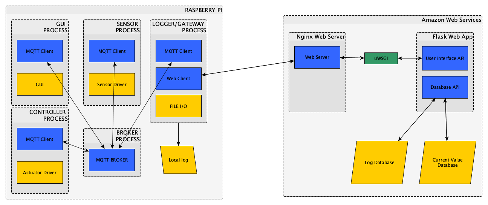

# Project and laboratories on communication systems
* Group 49
* Erling Rennemo Jellum S263558
* Mahmoud Bahmani S246318

## Introduction
With the advent of cheap microcontroller with networking capabilities solutions for automation in buildings is gaining traction. Our hypothetical customer is the maintainers of large scale industrial, public or commercial buildings like factories, universities or hotels. The aim of the project is to create a system for measuring and controlling the temperature in a building as well as providing an intuitiv interface to the system. There is an emphasis on using the M2M protocol MQTT for communication purposes. 

## Requirements
* A single temperature sensor connected through a Raspberry Pi
* A graphical user interface implemented on a Raspberry Pi with an LCD screen
* A web user interface
* UIs should let user see real time temperature, historical temperature and change the control policy
* Emulate a temperature controller with the Raspberry Pi
* Local logging of all events on the RPi
* Remote logging of all events to a database in the cloud
* Reply to ping messages from remote MQTT Broker

## Architecture
The system can roughly be divided into the *local* and the *remote system*. The *local system* consists of all the components that will be installed onsite with the customer, i.e. sensors, controllers, gateways etc. While the *remote system* is the system in the cloud, i.e. remote database, web user interface etc.

### Local System (Raspberry Pi)
The RPi is the key component in *local system*. It serves several functions that typically, for our hypothetical customers, would be divided between several components spread out over the building. Each of the functions are running in a separate process and communicating with another through MQTT thus we have a very scalable system. In Fig. 1 you will see the layout of the *local system* running on the RPi.

*Fig. 1: Local system*

#### Temperature Sensing
The sensor process is polling the external temperature sensor at a user-specify interval. Each sample is broadcasted on a dedicated MQTT topic.

#### Temperature Controlling
The controller process is emulating a temperature cntroller. It is implementing the simplest control algorithm. The heating system is turned ON when the temperature falls below the desired temperature and its turned OFF when it rises above the desired temperature. This control algorithm would result in a marginally stable system where the temperature would oscillate around the setpoint. To get a stable and fast system a PID controller or a Kalman filter could be implemented.

The controller process is subscribing to both the Temperature Topic and the Control Policy Topic.

#### Graphical User Interface
The graphical user interface (GUI) process displays the current temperature on the LCD screen and lets the user update the control policy and also view historical values of the temperature. The GUI subscribes to both the Temperature Topic and the Control Policy Topic. It accesses the local log file to display the historical values.

#### Logger/Gateway
The Logger/Gateway process is the link between the *local system*  and the remote web system. The Logger/Gateway subscribes to all the MQTT topics and logs them to a local file. It also makes HTTP Post requests to the remote web server to update the remote log. Moreove it periodically polls the remote web server to correct inconsistencies between the remote and local log. This is also how user input through the web ui is delivered to the *local system* . The Logger/Gateway also replies the Ping messages broadcasted from the MQTT Broker implemented by the Professor and Teaching Assistents.

#### MQTT Broker
The MQTT Broker process implements an MQTT Broker that connects all the components of the *local system*.

### Remote system (Amazon Web Services)
The *remote system*  is hosted at Amazon Web Services and is running on an Ubuntu EC2 instance in Paris. It contains a non relational database with a custom REST interface and a graphical user interface to be accessed with the browser. In Fig. 2 you see the layout of the *remote system* hosted on AWS.

*Fig. 2: Remote system*

#### Database
We have two non relational databases hosted on AWS. The first is the full log. All the events broadcasted with MQTT in the *local system* is entered here. Fig. 3 shows an entry with the different fields. The second database contains just a single entry per Customer as shown in Fig. 4, it holds the current value for the system variables, in our current case this is only *temperature* and *control policy*

The database interface is a REST interface that accepts GET requests and POST request to access *temperature* and *control policy* events. This interface is used by the Logger/Gateway process in the *local system* .

| Customer ID | Event ID | Timestamp | Data |
|---|-|-|-|
|123|0|23-06-2019T09:42:00|23.5|

*Fig. 3: Entry of the Log database*

| Customer ID | Timestamp-temperature | Temperature | Timestamp-control | Control | 
|---|-|-|-|--|
|123|24-06-2019T10:30:00|21.0|20-06-2019T08:38:00|17.0-17.0-17.0-18.0-18.0 ...|

*Fig. 4: Entry of the current value database*

#### Web user interface
The Web UI provides the user with a similar interface as the local GUI. It shows the current temperature and the current control policy. It lets the user change the control policy and it also lets the user see the average temperature for the last 24h and also the last week. The user input is stored in the database so that the Logger/Gateway can pull it later.

Fig. 5 shows the full system. Notice that the Logger/Gateway makes up the interface of the *local system* to the outside world. The Logger/Gateway communicates with the AWS Databases through the Nginx Web Server piped through uWSGI processed by our Flask backend which pulls data from the DynamoDB databases and sends the responses back the same way.

*Fig. 5: Full system*

## Technologies and frameworks
This system touches on many areas from low level drivers sampling analog sensor input to styling of HTML pages for the browser. We have therefor used a variaty of frameworks, protocols and languages discussed below.

### MQTT
Using MQTT was one of the main requirements and we have used it extensively. We have written our own MQTT Broker and MQTT Client using the Python package HBMQTT. All the processes of the *local system* is implementing either an MQTT Broker or a Client. MQTT is short for *Message Queuing Telemetry Transport* and is a lightweight publish and subsribe system that runs ontop of HTTP or WebSocket. MQTT clients, like the GUI, Temperature Sensor, Temperature Controller and Logger/Gateway, publish and subscribe messages to different topics. The Broker, or server, has the responisbility to distribute messages published on a certain topic to the clients subscribing to that topic. MQTT is becoming very popular for IoT solutions where we need to control devices remotely. There are several reasons for this popularity
- MQTT is open source. Anyone can inspect the source code and also make improvements or adjustments
- MQTT is lightweight. There is a small code footprint for running a MQTT Client.
- MQTT exposes devices that are behind a firewall with subscription

MQTT can also guarantee different levels of reliability with the Quality of Service (QoS) parameter. For each subscription a client makes, he also specifies the QoS which is either 1, 2 or 3. This correspond to different schemes for the Broker to deliver messages on that topic to the client.
- QoS_1: Fire and forget. Message is sent only once and no acknowledgement is required from the client
- QoS_2: Acknowledged delivery: Message is resent until the Broker receives an acknowledgement from the client. The Client could receive duplicates.
- QoS_3: Assured delivery: Client receives exactly one copy of the message. This is assured through a two-level handshake.

For the first draft of our product we have used QoS_1 and are using the following three topics: */sensors/temperature*, */user/control_policy* and */controller/onoff*. 

A typical MQTT message payload, a temperature sample from the Temperature Sensor would look like this:
**Timestamp=20-06-2019T08:38:00;Data=34.32913;Src=1**

### HTTP
We are using HTTP to connect the local and the *remote system* . The Gateway/Logger gets data from the *remote system*  by HTTP GET requests and publises data with HTTP POST requests. The Web UI is, of course, also served using HTTP.

### Asyncio
Asyncio is another Python Package that is very central in the *local system* . It allows for single threaded multitasking and is necessary to run a MQTT Client or Broker concurrently with anything else. Another solution could be to use multithreading but asyncio is superior as it is faster (no context switching) and is already used in HBMQTT

### TKinter
TKinter is a Python wrapper around the famous TK which is a GUI package for the TCL language. It has been used to write several notable desktop apps. The look and feel of TKinter is a bit archaic but it is an effective and well-documented tool. Other alternatives were Kivy and Qt which is more modern GUI engine in Python. 

### Flask
Flask is a microframework for writing web servers in Python. Our web service, hosted on AWS, has its backend written in Flask. With Flask it is extremely easy to develop and deploy web services. Flask is built ontop of Werkzeug which is a WSGI (Web Service Gateway Interface) library. WSGI is the Python standard for forwarding requests and responses between the actual web servers (typically Apache or Nginx) and the web application (written using f.x. Flask or Django). 

### uWSGI, Nginx, systemd
Flask servers can easily be deployed for testing, but it will then only be able to handle a few concurrent connection. To deploy for production we used the linux web server framework nginx to listen to port 80 and uWSGI to pipe incoming requests to the flask backend. The webserver is running on an Ubuntu machine hosted on AWS and this application is registred in systemd so that it automatically runs when the machine is booted.

### Amazon Web Services
Amazon Web Services (AWS) is a brilliant cloud serivce by Amazon. With a few keystrokes you can boot up a linux machine on one of their worldwide servers, and host a webpage or a web service. With Amazon Lambda you can serve http requests without even running a web service. We have used EC2 to host our web server and DynamoDB for the databases.

### Programming languages
All the components of the *local system*  is written with Python3. Python is very easy and well documented objected-oriented interpreted programming language. It is superior to C and Java when it comes to the ease of which you can create packages(libraries) and share them with others. In Python it is extremely easy to test and explore APIs and datastructures. Just fire up the interactive shell and you can explore APIs, datastructures and packages without having to recompile and run again and again. Python is an interpreted language and could only be used since we the *local system*  running on a full Operating System (Raspbian) with the Python interpreter installed. To run Python "bare metal" is not common or effective. Python is inferior to f.x. C in terms of speed and size. But due to its simplicity we ended up with using Python for 80% of our code.

For the *remote system* we use Python/Flask for the backend and Javascript, HTML and CSS for the frontend. 

## Security
Security is very importent for IOT systems like this and regularily security experts find serious flaws in these kind of systems. To protect our userdata the web user interface is password protected, each customer will have a username and password to access the web user interface where he can see real time data and change control policy. To make POST or GET requests to the database interface each customer needs to attach an unique APIKEY to identify himself, this API_KEY is currently just hardcoded into the config file running on the RPi. These measures both provides security and also makes the whole system more scalable. Now we can easily accommodate several customers. 
 
## Future improvements
- Make an IFTTT service
- Use secure connections (HTTPS)
- Use crypthography to ensure privacy between *local* and *remote system* 
- On the design side there is alot of improvements to be made. But we are engineers, not designers :)

